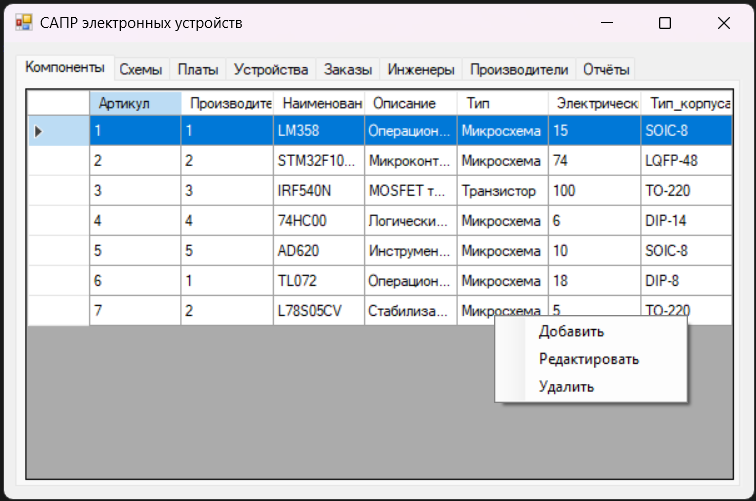

# Система управления разработкой электронных устройств/Electronic Device Management System
RU:

Учебный проект, разработанный для курса "Клиент-серверные приложения баз данных". Реализация информационной системы для САПР электронных устройств на C#/.NET.

## Основные возможности
- Централизованное хранение и управление проектными данными
- Управление заказами на разработку электронных устройств
- Контроль версий для устройств, схем и печатных плат
- База данных электронных компонентов и производителей
- Управление командой инженеров

## Пользовательский интерфейс

## Схема базы данных

## Основные сущности:
1. Заказы
2. Устройства
3. Схемы
4. Печатные платы
5. Компоненты
6. Производители
7. Инженеры

## Технологический стек
- Backend: ASP.NET Core
- СУБД: SQL Server

EN:

Academic project developed for the Client-server database applications course. Implementation of an information system for CAD of electronic devices in C#/.NET.

## Key features
- Centralized storage and management of project data.
- Management of orders for the development of electronic devices
- Control of the solution of devices, circuits and printed circuit boards.
- Database of electronic components and manufacturers
- Management of a team of engineers

## UI

## Database diagram

## Key findings:
1. Orders
2. Devices
3. Circuits
4. Printed circuit boards
5. Components
6. Manufacturers
7. Engineers

## Tech stack
- Server part: ASP.NET core.
- DBMS: SQL server
